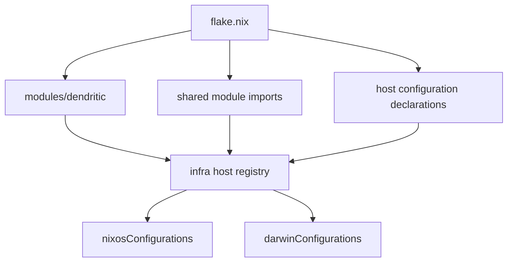

# Flake composition and host registry

`flake.nix` is the composition root. It pins NixOS, Home Manager, nix-darwin, service integrations, and tooling, then imports `modules/dendritic`, `modules/home`, `modules/nixos`, each enabled `hosts/<name>/configuration.nix`, and `dev.nix`. It supports `x86_64-linux`, `aarch64-linux`, and `aarch64-darwin`.

This diagram shows evaluated configuration construction; a host is exported only when its declaration is imported by `flake.nix`.

## Registry contract

`modules/dendritic/default.nix` defines `infra.modules`, `infra.nixos.hosts`, and `infra.darwin.hosts`. A host declaration supplies `system`, optional `specialArgs`, and ordered `modules`. `config.flake.nixosConfigurations` maps every NixOS host through `inputs.nixpkgs.lib.nixosSystem`; Darwin equivalents use `inputs.darwin.lib.darwinSystem`. `inputs` is always injected and is merged with `specialArgs`.

Host declaration files are registration surfaces, not the operating-system configuration: `hosts/<name>/default.nix` normally owns local settings and imports service/hardware files. See [the estate](../hosts/estate.md) for ownership and [developer workflow](../packages-and-developer-workflow.md) for build commands.

## Module classes and extension seams

* `modules/nixos/default.nix` imports `comfyui.nix`; that file registers `infra.modules.nixos.comfyui`, which Freya consumes.
* `modules/home/default.nix` imports Home Manager fragments. Each publishes a deferred module under `infra.modules.homeManager.<name>`.
* `modules/home/wiring.nix` registers the NixOS and Darwin Home Manager bridge modules as `infra.modules.nixos.home-manager` and `infra.modules.darwin.home-manager`.
* `modules/common/default.nix` is directly included by several NixOS host declarations and establishes SSH, Fail2ban, Tailscale, Netdata, and its state version. It is not a registry module.

To add a shared NixOS capability, register it from `modules/nixos/<name>.nix`, import it in `modules/nixos/default.nix`, then include `config.infra.modules.nixos.<name>` in the target host module list. The source-backed recipe and narrow evaluation check are in `docs/repository-usage.md`.

## Evaluation and validation

Use `.justfile` to list exported targets: `just list-nixos-hosts` and `just list-darwin-hosts`. Format only changed Nix files with `nixfmt --check ...`; evaluate one affected option with `nix eval .#nixosConfigurations.<host>.config...`; build a full system with `just build <host>` or `nixos-rebuild build --flake .#<host>`. Deployment is a state-changing step, not validation: use `just deploy <host>`, `just deploy-remote <host>`, or `just deploy-darwin` only after the relevant build.

Do not assume a directory is deployable: Fafnir is documented in [network topology](../networking/router-and-topology.md), but its import is commented out in `flake.nix`, so it is absent from the generated configuration set.