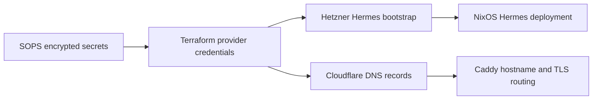

# Terraform cloud provisioning and DNS

Terraform has two independent roots: `terraform/hetzner` and `terraform/cloudflare`. Each requires SOPS and an S3 backend configured outside tracked source. Run Terraform commands from the intended root; a plan in one root does not cover the other.

## Hetzner bootstrap

`terraform/hetzner/main.tf` decrypts the structured Terraform secret input, registers the configured SSH public key, creates the `hermes` server using a Debian image, enables IPv4/IPv6, runs `nixos-infect.sh` as cloud-init/user data, and creates the mail reverse-DNS record. `provider.tf` obtains the Hetzner token from the SOPS data source. This is the bootstrap path for the NixOS Hermes host, not a replacement for the host's flake deployment.

## Cloudflare DNS

`terraform/cloudflare/main.tf` describes DNS resources including generic web/IPFS records, private-overlay records, and mail records—A, MX, SPF, DKIM, and DMARC—as well as other domain verification/application records. The Cloudflare provider reads its token from the SOPS data source. Caddy's DNS TLS configuration independently needs a runtime Cloudflare credential on the relevant host; creating a Terraform record does not supply Caddy credentials. See [edge routing](../services/edge-and-identity.md).

## Replacing Hermes or changing its address

The Hetzner server resource selects the Debian image/type, `nixos-infect.sh` user-data bootstrap, registered SSH key, and public IPv4/IPv6. `hcloud_rdns.master` derives the IPv4 PTR from that server and points it at `mail.mbauce.com`; Cloudflare's `cloudflare_record.mail` independently maps that name to the current Hermes IPv4. `hosts/hermes/networking.nix` is the NixOS-side static network contract: it hard-codes Hermes's IPv4/IPv6 addresses, `/32` IPv4 route, and gateway rather than using DHCP. Inspect both Terraform roots and this host file before a replacement. The complete inspected inventory of the current Hermes public IPv4 literal is Cloudflare records `mail` and `murmur`; the Hetzner server address itself is provider-derived rather than a literal. Caddy uses hostnames for the inspected cross-host upstreams, while Tyr's monitoring uses hostname `hermes`, so neither is an inspected literal-IP dependency. No other source literal-IP dependency was found in the reviewed deployment, host-networking, Cloudflare DNS, Caddy, and Prometheus configuration scope.

Safe sequence: make a reviewed Hetzner plan and apply/record the new server address; update the static Hermes network configuration and Cloudflare mail-related A records plus PTR; ensure the host declaration in `hosts/hermes/configuration.nix` still composes the intended NixOS modules; then build/deploy Hermes and verify mail, TLS, and monitoring separately. The S3 backend and SOPS provider decryption remain prerequisites before any plan or apply. Do not describe an address as changed until both provider state and the Nix host configuration agree.

## Change discipline

This depicts dependency direction; state backend and cloud credentials are external operational prerequisites.

Run `terraform fmt -check` followed by `terraform plan` in the changed root with authorized decryption and backend access. Review destructive replacements, server bootstrap changes, DNS record identity, proxy flag, MX priority, and reverse DNS before apply. Do not print decrypted values, provider tokens, or state content. The detailed encryption/access model is in [credentials](../security/secrets-and-credentials.md).