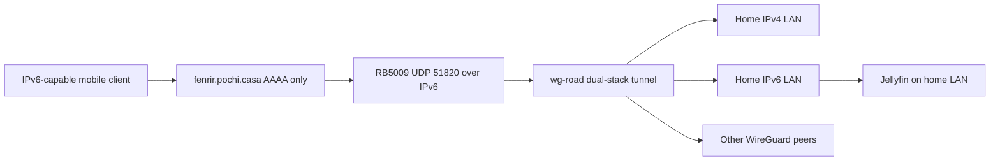

# RB5009 IPv6-only WireGuard road-warrior access

This is the operational RouterOS configuration for road-warrior access through the RB5009. It is **not** managed by the Nix flake: the separately declared [Fafnir router topology](router-and-topology.md) remains unexported in `flake.nix` and uses different VLAN and IPv4 ranges. Do not apply, derive, or validate RB5009 changes through `just build`; use RouterOS inspection and a controlled client connection instead.

The public path is IPv6-only; the tunnel carries selected IPv4 and IPv6 traffic to the home network and other peers.

## Address and DNS contract

| Purpose | Value |
|---|---|
| Public endpoint | `fenrir.pochi.casa:51820` |
| Endpoint DNS | AAAA `2a07:7e81:85f5::`; no A record |
| WireGuard interface | `wg-road` with MTU `1420` |
| Tunnel IPv4 network | `10.253.90.0/24`; RB5009 `10.253.90.1/24` |
| Allocated ULA and tunnel subnet | `fdf9:7597:d29::/48`; `fdf9:7597:d29:90::/64` |
| RB5009 tunnel IPv6 | `fdf9:7597:d29:90::1/64` |
| Home LANs routed to clients | `192.168.0.0/24` and `2a07:7e81:85f5::/64` |

The endpoint intentionally has no IPv4 DNS record or IPv4 UDP exception. A client without working IPv6 cannot establish this tunnel by design. Keep the endpoint, interface, and tunnel subnet consistent across RouterOS peer entries and client configurations.

## Peer and route boundaries

Create `wg-road` on UDP `51820`, assign the router's IPv4 and ULA addresses above, and configure each RouterOS peer with only addresses allocated to that peer. For the documented iPhone allocation, those are `10.253.90.10/32` and `fdf9:7597:d29:90::10/128`.

**Do not put the home LAN prefixes in the RouterOS peer `allowed-address`.** They are networks behind the RB5009, not source addresses owned by the phone. On the iPhone, the peer's `AllowedIPs` instead selects the tunnel network, home IPv4 LAN, home IPv6 LAN, and WireGuard ULA subnet. `PersistentKeepalive = 25` maintains reachability through NATed mobile clients. Never copy, commit, or place a WireGuard private key in this repository.

The [Sauron service system](../services/sauron-media.md) owns Jellyfin, which the runbook uses as a home-LAN reachability probe; this does not make Sauron's service configuration the owner of RB5009 routing.

## Configuration backup

The [Freya workstation](../workstations/freya.md) is the repository-managed backup client for this router. It enables `services.plakar-routeros-backup` with the `export` and `backup` formats against `192.168.0.1`; the reusable implementation in `modules/nixos/plakar-routeros-backup.nix` runs Plakar after `network-online.target` as a `oneshot` service and schedules a persistent weekly timer. The repository passphrase is supplied to systemd as a credential, and the SSH key is an external service-user-readable path; neither belongs in RouterOS commands, the runbook, or source control.

When changing RouterOS backup formats, timing, repository location, account, or credential wiring, change the module consumer and its implementation together as needed, then run `just build freya`. `tests/plakar-routeros-backup.nix` is the focused assertion surface for the service type/user/credential, both configured modes, and timer persistence. This host-side backup validates configuration collection, not WireGuard reachability or firewall behavior; retain the external tunnel checks below.

## IPv6 firewall ordering

Allow the IPv6 UDP handshake on WAN and allow forwarding from `wg-road` to both `wg-road` and the home IPv6 `/64`. These accept rules must be ordered as follows:

1. Established/related, invalid, and ICMPv6 baseline rules.
2. The `WG: allow ipv6 handshake` input accept rule.
3. The final input drop for traffic not from `LAN`.
4. Standard forward rules.
5. The `WG: peer-to-peer ipv6` and `WG: home LAN IPv6` forward accepts.
6. The final forward drop for traffic not from `LAN`.

The ordering is the important contract: accepts after either default drop are unreachable for WAN/mobile traffic, even though a LAN-originated handshake can appear to work. Keep IPv4 WAN UDP `51820` closed to retain the IPv6-only transport boundary.

## Change and incident procedure

Consult this page when changing the RB5009 interface, a peer allocation, tunnel routes, endpoint DNS, IPv6 filtering, or client MTU. Make one scoped RouterOS change at a time and preserve an out-of-band recovery path before changing WAN/firewall behavior.

1. Confirm DNS: `dig +short AAAA fenrir.pochi.casa` must return `2a07:7e81:85f5::`; `dig +short A fenrir.pochi.casa` must return nothing.
2. Inspect peer state and a recent handshake: `/interface wireguard peers print detail`.
3. Inspect WireGuard rule presence and counters: `/ipv6 firewall filter print where comment~"WG"` and `/ipv6 firewall filter print stats`.
4. From the RB5009, probe the Jellyfin host with source `fdf9:7597:d29:90::1`. A successful HTTPS fetch may report `302`, because Jellyfin redirects `/` to `/web/`; that confirms TCP, TLS, and service reachability.
5. Test from an IPv6-capable external/mobile client. If it handshakes but cannot reach the LAN, recheck route scope and forward-rule ordering. If it never handshakes, recheck AAAA resolution and WAN input filtering.
6. If small requests succeed but larger pages stall, test MTU `1280` on both `wg-road` and the iPhone before pursuing application faults. Use `/tool/sniffer/quick` on `wg-road`, scoped to the target host and port, for packet-level diagnosis.

There is no focused repository build or test for this RouterOS state. `docs/rb5009-wireguard-ipv6.md` is the primary command-level source; this page records its operational contract and routes related repository-owned service and topology changes to their owning concepts.
