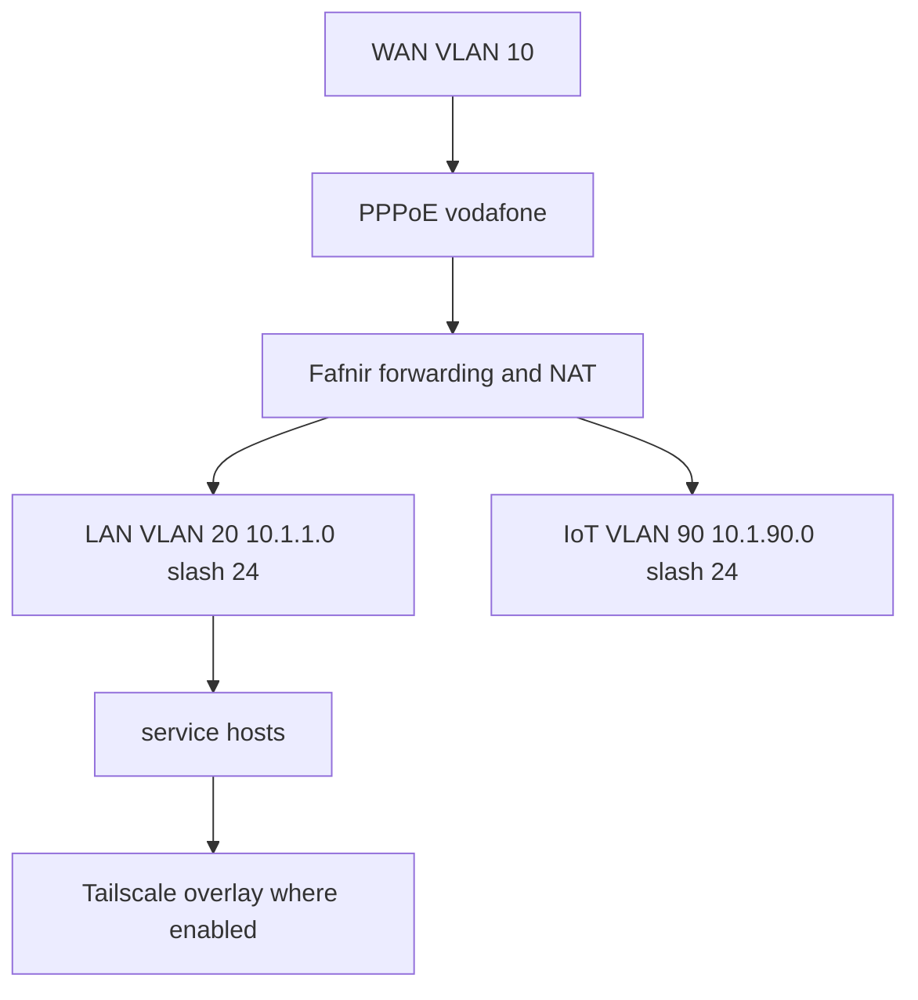

# Router and network topology

`hosts/fafnir/default.nix` defines the router design, but `flake.nix` comments out `./hosts/fafnir/default.nix`. Therefore Fafnir is **not exported** as a current `nixosConfigurations` target; do not expect `just build fafnir` to work until a declaration and import are restored.

This represents the declared router intent, not an evaluated deployment.

## Fafnir boundaries

Fafnir enables IPv4 and IPv6 forwarding and NAT; DHCP is disabled on physical interfaces. VLAN `wan` uses `enp1s0` with ID 10, while `lan` and `iot` use `enp2s0` with IDs 20 and 90. It assigns `10.1.1.1/24` to LAN and `10.1.90.1/24` to IoT. Its `pppd` peer uses `rp-pppoe.so wan`, requests the default route, persists through failures, and waits five seconds before retrying. Altering interface/VLAN names, the default route, or forwarding policies changes connectivity for every dependent service.

The source contains literal PPP credentials and other sensitive material; this wiki intentionally does not reproduce them. Migrate secrets before expanding this surface; see [credentials](../security/secrets-and-credentials.md).

## Shared addressing and overlays

Sauron, Tyr, Zima, Freya, Fenrir, and Aron declare addresses from the same IPv6 /64 and reference the same link-local gateway, each on a host-specific interface. Treat this as a coordinated convention: interface or gateway changes require updates to all consumers, not just one host. Tailscale is enabled through the common module and explicitly on Pixie; it is used as a private exposure boundary for the Sauron Minecraft service. Ushi has the common Tailscale baseline.

Cross-host runtime dependencies include Tyr scraping Hermes mail exporters and Zima joining Tyr's K3s server. Hermes proxies public requests to Pocket-ID on Sauron and Actual on Zima. These flows are explained in [edge and identity](../services/edge-and-identity.md) and [cluster and observability](../services/cluster-and-observability.md).

## Safe changes

For an exported host, evaluate the affected `networking` option then build that host. Router work is evidence-blocked until Fafnir is restored to the flake: first add a valid host declaration, ensure the correct hardware module is included, then use `nix eval` to confirm it appears before attempting a build or remote deployment. Never apply a routing/firewall change remotely without an out-of-band recovery plan.