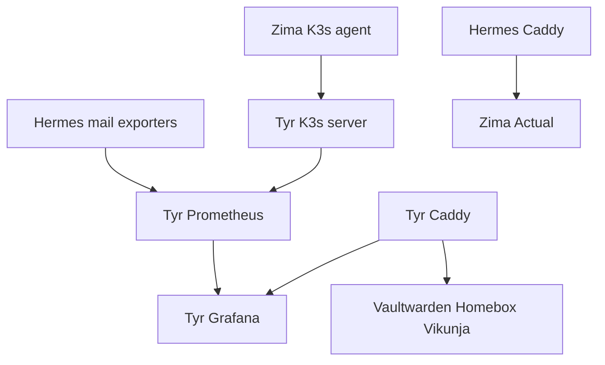

# Tyr and Zima cluster, applications, and observability

Tyr is a K3s server with `clusterInit = true`; Zima is an agent with the same literal token currently written directly in both host configurations, pointing at `https://192.168.0.104:6443`. This is not delivered by the secret framework. Tyr sets the server TLS SAN to `pumba.pochi.casa`; changing that control-plane/public name without reissuing/updating client expectations can break TLS clients. Tyr opens TCP 6443/6444 (API-related), 2379/2380 (embedded etcd), and UDP 8472 (Flannel), while Zima opens TCP 6443/6444/2379/2380 and UDP 8472. Tyr enables Docker `ipv6` and `ip6tables` with fixed CIDR `fd00:dead:beef::/48`: the source comment says this is necessary because IPv6-only public DNS for `*.pochi.casa` must reach published Docker ports through PREROUTING DNAT rather than be dropped at INPUT. Zima uses Docker's btrfs storage driver and has firewall allowances for Actual and optional MQTT.

This diagram combines declared Kubernetes membership, telemetry scrape ownership, and ingress; it does not imply all applications run inside K3s.

## Telemetry

Tyr's Prometheus scrapes its own node exporter on port 9000 plus Hermes Dovecot on 9160, Rspamd on 11334 at `/metrics`, and Postfix on 9117; it also has an ESPHome target. Hermes opens 9160 and 9117 in its host firewall for the mail exporters. Grafana binds to loopback port 3000, provisions `http://127.0.0.1:${config.services.prometheus.port}` as its default Prometheus datasource, and loads the SMTP dashboard JSON from `hosts/tyr/dashboards/smtp.json`. Tyr Caddy exposes Grafana using the Cloudflare DNS TLS credential. Grafana has an agenix secret declaration, but the inspected module does not wire it to a Grafana OIDC configuration; do not assume OIDC is active merely from the declaration. Likewise, a configured scrape target is not evidence of tested target-name resolution or network reachability.

## Application services

Tyr enables Homebox, Vaultwarden, and Vikunja. Homebox disables local login and trusts its proxy, then uses a Pocket-ID OIDC secret environment file; Vaultwarden uses SQLite and a backup directory, binds to loopback, and consumes its OIDC secret; Vikunja disables local auth and gets its OIDC configuration partly from systemd environment plus an agenix environment file. Each is fronted by a local Caddy virtual host and has its own callback/client identifier. Public route ownership and issuer dependency are in [edge and identity](edge-and-identity.md); secret contracts are in [credentials](../security/secrets-and-credentials.md).

For Warship connectivity, Tyr's firewall permits TURN/STUN port `3478` over TCP and UDP plus UDP relay allocations `49160`–`49200`. The relay range is required after a successful TURN handshake; omitting it can yield an ICE failure where no traffic relays. No coturn service configuration is declared in the inspected Tyr files, so this repository documents only the host reachability policy. Pairing traffic uses `signal.pochi.casa`, which [Sauron Caddy](sauron-media.md) proxies to NodePort `30777` on both K3s nodes; it is a WebSocket signaling path, not the TURN or peer-to-peer data path.

`miniflux.nix` provisions PostgreSQL, Miniflux, OIDC, Caddy, and secrets but is commented out in Tyr's `default.nix`, so it is inactive. `services.miniflux` in Zima's default is separately enabled and references an external credentials path; this is distinct from that module.

Zima runs PostgreSQL 16 with an `atuin` database/user and Actual on port 5006. Actual disables `DynamicUser`, creates a persistent `actual` user/home, and injects its OIDC secret through the service settings. Hermes routes the budget hostname to it. Mosquitto is configured but disabled. Changes to Actual user ownership, the secret path, or the upstream hostname must be coordinated.

## Focused validation

`just build tyr` and `just build zima` are the narrow configuration builds. Evaluate a changed service option first. After deployment, check the relevant systemd units; for telemetry, verify Prometheus target health and Grafana datasource/dashboard loading. Cluster changes need a node/API reachability plan; neither Nix evaluation nor a service build confirms a healthy K3s join.