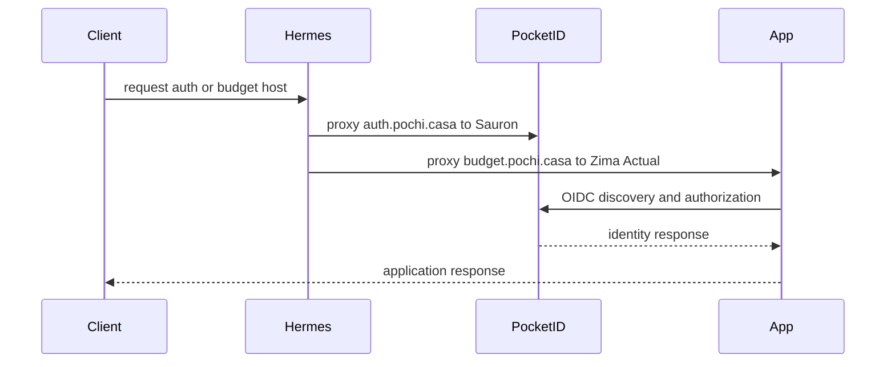

# Edge routing and identity

Caddy ingress is distributed, not centralized. Hermes provides public cross-host routing; Sauron fronts local NAS services and hosts Pocket-ID; Tyr independently terminates TLS for application services. DNS TLS uses the Cloudflare Caddy plugin and a service-readable agenix token wherever explicitly configured. Its ownership/mode and injection contract is in [credentials](../security/secrets-and-credentials.md).

| Edge host | Public host | Upstream | Exposure and source |
|---|---|---|---|
| Hermes | `auth.pochi.casa` | `sauron.pochi.casa:1411` | Cross-host proxy to Pocket-ID; `hosts/hermes/caddy.nix` |
| Hermes | `budget.pochi.casa` | `zima.pochi.casa:5006` | Cross-host proxy to Actual |
| Hermes | `trippiamo.mbauce.com` | `tyr.pochi.casa:6767` | Cross-host proxy |
| Sauron | `torrent.pochi.casa`, `prowlarr.pochi.casa`, `sonarr.pochi.casa`, `radarr.pochi.casa`, `usenet.pochi.casa`, `paperless.pochi.casa`, `jelly.pochi.casa`, `jellyseerr.pochi.casa` | localhost 8088, 9696, 8989, 7878, 8080, 28981, 8096, 5055 | Cloudflare DNS TLS; `hosts/sauron/caddy.nix` |
| Sauron | `cuppy.pochi.casa` | two K3s node addresses on `30298` | Cross-cluster upstream |
| Tyr | `homebox.pochi.casa`, `grafana.pochi.casa`, `pass.pochi.casa`, `vikunja.pochi.casa` | localhost 7745, 3000, 8222, 3456 | local Caddy vhosts defined by the service modules |
| Tyr disabled module | `feed.pochi.casa` | localhost 8080 | Miniflux is not imported by Tyr's `default.nix` |

The sequence is the declared Hermes-to-Sauron/Zima identity path; each application uses its own callback and client credential.

## Identity owner and consumers

`hosts/sauron/pocked-id.nix` enables Pocket-ID on port 1411, listens on IPv6 any-address, trusts its proxy, and sets `APP_URL` to `https://auth.pochi.casa`. Hermes is therefore an availability and forwarding dependency for the issuer URL. `TRUST_PROXY = true` is required because Hermes supplies the public-facing proxy boundary while Pocket-ID binds to `::`.

| Relying party | Public URL / issuer contract | Client and callback contract | Injection mechanism |
|---|---|---|---|
| Actual on Zima | `https://budget.pochi.casa`; discovery at `https://auth.pochi.casa/.well-known/openid-configuration` | client `0fa04795-9c36-4385-95c6-820731758fbd`; Actual stores the public server hostname | generated secret path assigned to `openId.client_secret._secret` |
| Homebox on Tyr | `https://homebox.pochi.casa`; issuer `https://auth.pochi.casa` | client `bf75c2a3-e27b-45a3-9898-12d5cbfd5932`; OIDC enabled, local login disabled, proxy trusted | systemd `EnvironmentFile`; currently subject to the documented path mismatch in [credentials](../security/secrets-and-credentials.md) |
| Vikunja on Tyr | `https://vikunja.pochi.casa`; issuer `https://auth.pochi.casa` | client `436a474a-15aa-444a-8ba1-e7dce352eb9d`; redirect `https://vikunja.pochi.casa/auth/openid/pocketid` | `environmentFiles` plus `systemd.services.vikunja.environment` |
| Vaultwarden on Tyr | `https://pass.pochi.casa`; authority `https://auth.pochi.casa` | client `418ad0f4-ab95-4945-96fc-d22c1e1d3a4e`; loopback port 8222 behind Caddy | service `environmentFile` |
| Miniflux on Tyr (inactive) | `https://feed.pochi.casa`; discovery issuer | client `miniflux`; redirect `https://feed.pochi.casa/oauth2/oidc/callback` | two environment files: database and OIDC |

Grafana declares an OIDC secret but the inspected module does not configure Grafana OIDC; do not infer it is a relying party. To onboard another client, register its exact public URL/redirect with Pocket-ID, add its host-appropriate age recipient in `secrets/secrets.nix`, declare the runtime file and consumer injection, add the Caddy route/DNS TLS path, and validate the login redirect. Do not change a public hostname independently: change the Caddy route, application base URL/redirect URL, OIDC registration, DNS/TLS prerequisite, and then validate the consumer.

## Exposure semantics

`listenAddress = "127.0.0.1"` services require their local Caddy frontend; Hermes routes only hosts listed in its generated Caddyfile. Sauron's Caddy generator also has a supported `type = "nut"` branch: it serves the NUT CGI root, rewrites `/` to `upsstats.cgi`, and reverse-proxies `*.cgi` through `fcgiwrap` over `/run/fcgiwrap.socket`; no current vhost selects this branch. Sauron's Minecraft module explicitly does not open its firewall and is intended for Tailscale access, so it is outside Caddy ingress. Services with `openFirewall = false` rely on their reverse proxy rather than direct service exposure; Sauron still opens host ports 80/443 (plus listed service/game ports) and Tyr opens 80/443 through its application modules. A Caddy vhost is not proof that Terraform owns or currently publishes an authoritative DNS record. Caddy routes use compression and most Sauron/Tyr routes request DNS-based TLS. Build the hosting system after an ingress change, then verify Caddy unit status and a non-sensitive HTTP/TLS request from the appropriate network.