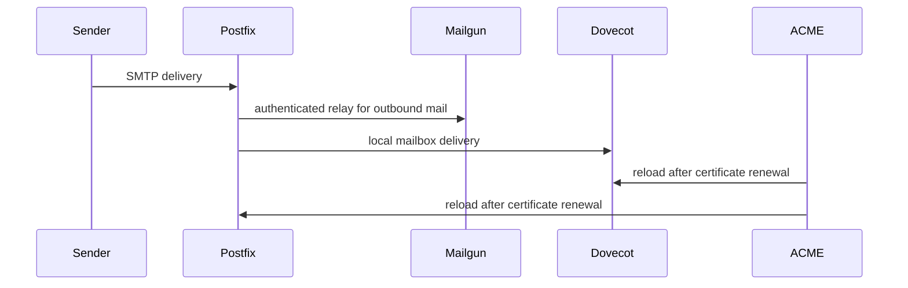

# Hermes mail, proxy, and agent services

`hosts/hermes/default.nix` composes hardware/networking, `mail.nix`, `kanban.nix`, `caddy.nix`, and `hermes-agent.nix`. It configures the host firewall for HTTP, SMTP/IMAP and exporter/service ports, and obtains one Murmur secret through SOPS. The enabled functional systems are mail, Caddy ingress, and Hermes agent; Vikunja in `kanban.nix` and Murmur are disabled.

## Mail delivery and certificates

`hosts/hermes/mail.nix` enables `simple-nixos-mailserver` for FQDN `mail.mbauce.com` and domain `mbauce.com`. Its declared account is `me@mbauce.com`; its hashed password comes from `/var/lib/mail-accounts/me/pssw`, and aliases route many purpose-specific addresses to that account. The active sieve rule files messages whose `list-id` matches `nexa@server-nexa.polito.it` into `Nexa`. The mailserver also directs Borg backups to its configured remote repository. The certificate references the mail FQDN. ACME uses Cloudflare DNS credentials from an agenix materialized file and reloads `dovecot2` and `postfix` after certificate renewal.

Hermes is provisioned by the Hetzner root and has static networking in `hosts/hermes/networking.nix`; the cloud server, its PTR, and the Cloudflare `mail` A record must describe the same address. Cloudflare additionally declares apex MX to `mail.mbauce.com`, SPF, DKIM, and DMARC. This mail identity chain is detailed in [Terraform provisioning](../infrastructure/terraform.md).

This depicts the explicit relay and certificate reload dependencies, not an exhaustive mail protocol flow.

Postfix relay configuration points at Mailgun. `mailgun-sasl-passwd` is a `oneshot` service that creates `/var/lib/postfix/sasl_passwd` from an agenix secret, sets it to `root:postfix` mode `640`, and Postfix explicitly `requires` and starts `after` it. Preserve that ordering and output contract when rotating the credential. Dovecot's old-stats plugin exposes `/var/run/dovecot2/old-stats`, consumed by the Dovecot exporter; the Postfix exporter is enabled too. Hermes opens TCP 9160 and 9117 for those exporters, alongside 80, 25, 143, 465, and 7980. Tyr scrapes `hermes:${config.services.prometheus.exporters.dovecot.port}` and `hermes:${config.services.prometheus.exporters.postfix.port}`; configured targets are not evidence that DNS resolution or network reachability is tested by this repository. See [cluster and observability](cluster-and-observability.md).

## Agent and edge role

`hosts/hermes/hermes-agent.nix` uses the host SSH key as an agenix identity, materializes a root-owned environment file for `services.hermes-agent`, enables the package, and selects the configured ZAI model/provider/base URL. Its credentials must remain in the environment file, not Nix literals; follow [credentials](../security/secrets-and-credentials.md).

Hermes Caddy is the cross-host ingress tier: it reverse-proxies identity, budgeting, and Trippiamo hosts. Its complete route and OIDC consequences are in [edge and identity](edge-and-identity.md).

## Focused validation

Build with `just build hermes`. After deployment, inspect `systemctl status postfix dovecot2 caddy hermes-agent` and relevant journal metadata. For a mail change, validate the generated service descriptions first and test only with a controlled mailbox/message; do not emit credential material or account data into logs.