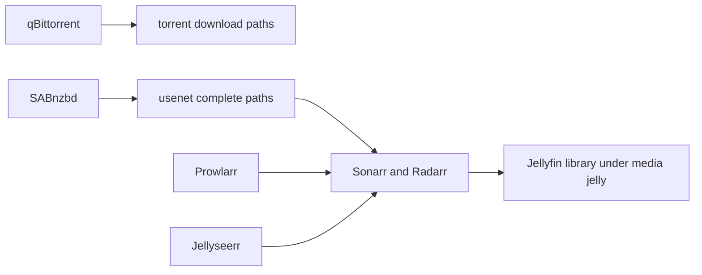

# Sauron media, storage, identity, and games

Sauron is the NAS/service host. `hosts/sauron/default.nix` imports hardware, Disko, Pocket-ID, Caddy, Paperless, and Minecraft. It configures ZFS auto-scrub for pool `data` and uses `/media` as the media root. The active `disk-config.nix` declaration creates a GPT disk with EFI and ZFS pool `zroot` (`/`, `/nix`, and a swap volume). Its prospective `data` pool plus `/media` and `/bck` datasets is commented out: it is not created by the current Disko configuration. This discrepancy is a persistence risk—services writing `/media`, `/var/lib/qbittorrent`, `/var/lib/minecraft`, or `/var/backup/vaultwarden` need verified, durable mounts/backups rather than an assumed Disko-managed `data` pool. Disko is a destructive provisioning surface, not routine service configuration.

## Media pipeline and invariant

This flow summarizes configured service roles and the shared media filesystem; service integrations beyond their configured endpoints are application-managed.

qBittorrent is enabled with group `media`, profile `/var/lib/qbittorrent`, web UI port 8088, and `/media/torrent/download` plus `.incomplete` paths. `tmpfiles` creates `/media` as `root:root 0755`; `/media/usenet`, `incomplete`, and `complete` as setgid `2775` paths shared by `sabnzbd:media`, with a recursive `Z` permission repair on completed content; `/media/jelly`, `shows`, and `movies` are setgid `2775` with Jellyfin as owner for the library directories. SABnzbd has group `media` and `UMask = "0002"`; Sonarr and Radarr also use group `media`; Jellyfin reads `/media/jelly`. Its stateful `/var/lib/sabnzbd/sabnzbd.ini` can otherwise default completed-job directories to `0700`, so `systemd.services.sabnzbd.serviceConfig.ExecStartPre` rewrites an existing `permissions` setting to `775` before every start. Keep that startup repair together with the setgid paths and UMask: it prevents completed downloads becoming ineligible for Sonarr/Radarr import. The critical invariant is group readability across downloader, organizer, and Jellyfin: do not alter paths, service/group ownership, tmpfiles modes, the SABnzbd internal setting, or UMask in isolation.

Prowlarr, Sonarr, Radarr, SABnzbd, and Jellyseerr have `openFirewall = false`; qBittorrent has no direct service firewall declaration. Their intended HTTPS interfaces are the Caddy routes listed in [edge and identity](edge-and-identity.md): torrent 8088, Prowlarr 9696, Sonarr 8989, Radarr 7878, Usenet 8080, Jellyfin 8096, and Jellyseerr 5055. The host nevertheless opens 80/443 and separately lists ports 8096 and 9091; treat that as a host exposure decision, not proof every local service is private. Transmission is configured but disabled.

## Documents, identity, games, and power

Paperless is enabled with an agenix-backed environment file and public URL; Pocket-ID on port 1411 is the repository's issuer and is proxy-reached through Hermes. Both depend on [credentials](../security/secrets-and-credentials.md). Sauron Caddy also routes `signal.pochi.casa` to K3s NodePort `30777` on both Tyr and Zima. This WebSocket signaling route only exchanges peer setup data; the game data path is peer-to-peer, while TURN is a separate direct endpoint on Tyr governed by the firewall rules documented in [cluster and observability](cluster-and-observability.md). Minecraft enables a Fabric 1.21.1 Cobblemon server, symlinks fetched mod jars into its data directory, has no open firewall, and is intended for Tailscale access. The disabled NeoForge `fits4` server expects manually supplied modpack directories; enabling it adds that mutable-data prerequisite.

`services.bo3-server` is enabled on UDP/TCP port 27017 with an explicit map rotation. NUT/UPS monitoring reads an agenix password and defines a standalone USB UPS monitor. Netdata has a token file. These are both service-owned credential paths; retain their declared owners and modes.

## Validation

Use `just build sauron`. For media permission changes, inspect generated tmpfiles/service users and test a small controlled file traversal, then check `jellyfin`, downloader, and Caddy unit status. Disko, ZFS, game data, backups, and external service databases are stateful: a successful evaluation does not prove data migration safety.